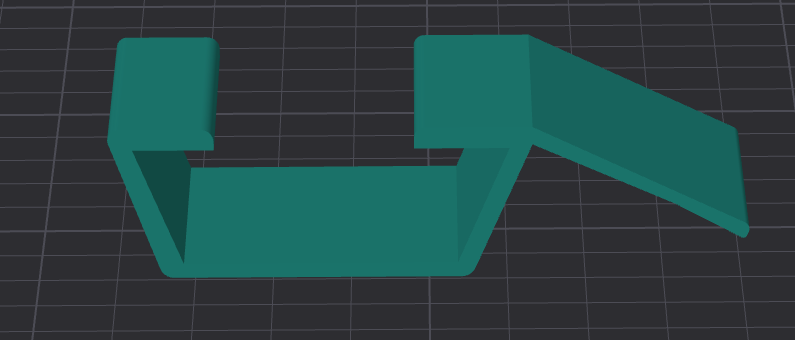
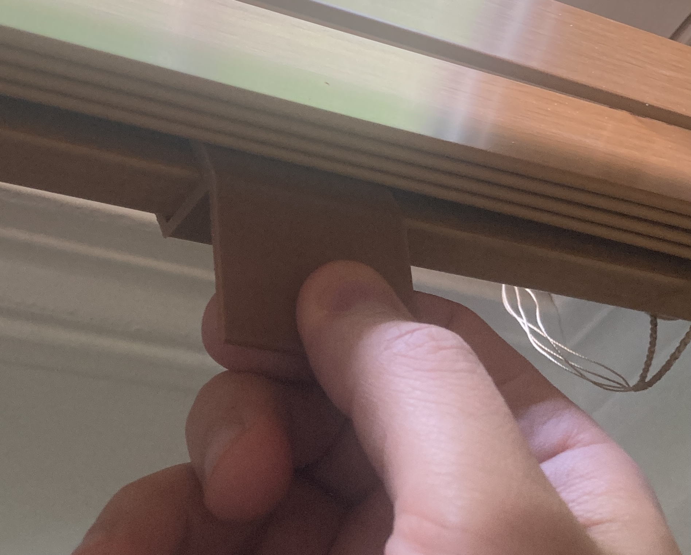

# Blinds-To-Go-2-Horizontal-Faux-Wood-Clips

In 2019, corded blinds were phased out due to too many children getting injured or killed by the cords. Blinds To Go manufactures 2" horizontal blinds that can require a significant amount of force to pull down. This part was created to clip on to the base of the 2" Horizontal faux wood blinds to create tabs which can be used to pull the blinds down easily. For blinds wider than 18", two clips per blind is recommended so that the blinds can be pulled down with two hands. This part was designed in OnShape. STL and STEP files are provided in this repo. This example was printed with PLA-F. 

